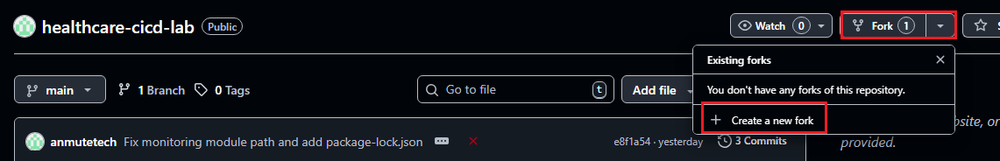
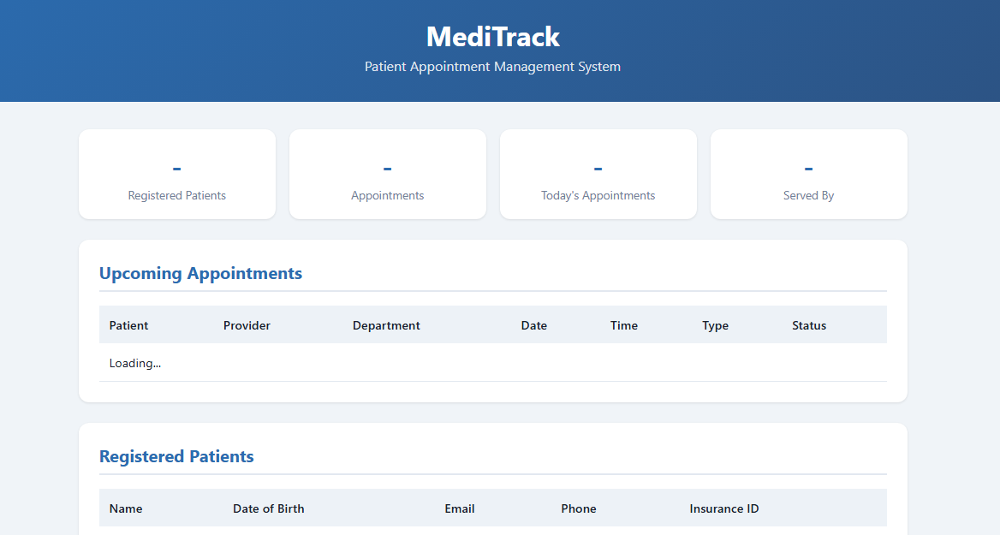

# Healthcare CI/CD Lab — MediTrack Patient Appointment System

A real-world CI/CD lab built around **MediTrack**, a patient appointment management API for a healthcare company. Students build and deploy the application through a fully automated GitHub Actions pipeline that includes testing, Docker image publishing, and Kubernetes deployment.

## Scenario

You have joined the DevOps team at **MediTrack Health**, a mid-size healthcare provider. The development team has built a patient appointment API and your job is to set up a CI/CD pipeline that:

1. Runs automated tests on every push and pull request
2. Builds and pushes the container image to DockerHub
3. Deploys the application to the company's EKS cluster
4. Exposes Prometheus metrics for the operations team to monitor

The application must pass all tests before it can be deployed to production.

> **Next step:** Once you complete this lab, move on to the [Healthcare DevSecOps Lab](https://github.com/anmutetech/healthcare-devsecops-lab) to add security scanning, secret detection, and policy enforcement to this pipeline.

## What Gets Created

- **MediTrack API** -- Node.js/Express application with patient registration, appointment scheduling, and a dashboard UI
- **Automated Tests** -- Jest test suite covering all API endpoints with coverage reporting
- **Docker Image** -- Multi-stage build with non-root user, health check, and Alpine base
- **Kubernetes Deployment** -- 3 replicas with liveness/readiness probes, resource limits, and ConfigMap-based configuration
- **Prometheus Metrics** -- Request count, request duration, and appointment counters scraped every 15 seconds
- **CI/CD Pipeline** -- 3-stage GitHub Actions workflow (Test → Build → Deploy)

## Architecture

```
 ┌─── GitHub Actions Pipeline ─────────────────────────────────────────────────────────┐
 │                                                                                      │
 │   ┌──────────────┐         ┌──────────────────┐         ┌──────────────────┐        │
 │   │  1. Test      │         │  2. Build &      │         │  3. Deploy       │        │
 │   │              │         │     Push          │         │     to EKS       │        │
 │   │  npm ci      │────────▶│                  │────────▶│                  │        │
 │   │  npm test    │         │  docker build    │         │  kubectl apply   │        │
 │   │  eslint      │         │  docker push     │         │  set image       │        │
 │   │  coverage    │         │  :latest + :sha  │         │  rollout status  │        │
 │   └──────────────┘         └────────┬─────────┘         └────────┬─────────┘        │
 │                                     │                            │                  │
 └─────────────────────────────────────┼────────────────────────────┼──────────────────┘
                                       │                            │
                                       ▼                            ▼
 ┌──────────────────┐    ┌─── EKS Cluster ─────────────────────────────────────────────┐
 │  DockerHub       │    │                                                              │
 │  ┌────────────┐  │    │  ┌─── Namespace: meditrack ────────────────────────────┐     │
 │  │ meditrack- │  │    │  │                                                     │     │
 │  │ api:latest │──┼───▶│  │  ┌─────────┐  ┌─────────┐  ┌─────────┐            │     │
 │  │ api:<sha>  │  │    │  │  │  Pod 1  │  │  Pod 2  │  │  Pod 3  │            │     │
 │  └────────────┘  │    │  │  │  :3000  │  │  :3000  │  │  :3000  │            │     │
 └──────────────────┘    │  │  │ /health │  │ /health │  │ /health │            │     │
                         │  │  └────┬────┘  └────┬────┘  └────┬────┘            │     │
                         │  │       └──────┬─────┴────────────┘                  │     │
                         │  │              ▼                                     │     │
                         │  │  ┌───────────────────────┐  ┌──────────────────┐   │     │
                         │  │  │  Service (LB)         │  │  ConfigMap       │   │     │
                         │  │  │  Port: 80 → 3000      │  │  NODE_ENV=prod   │   │     │
                         │  │  └───────────────────────┘  │  LOG_LEVEL=info  │   │     │
                         │  │                              └──────────────────┘   │     │
                         │  └─────────────────────────────────────────────────────┘     │
                         │                                                              │
                         │  ┌─── Monitoring ──────────────────────────────────────┐     │
                         │  │  Prometheus scrapes /metrics (15s)                  │     │
                         │  │  → http_requests_total                              │     │
                         │  │  → http_request_duration_seconds                    │     │
                         │  │  → appointments_total                               │     │
                         │  └─────────────────────────────────────────────────────┘     │
                         └──────────────────────────────────────────────────────────────┘
```

## Prerequisites

### 1. EKS Cluster

This project deploys to the `migration-eks-cluster` provisioned by the [Cloud Migration Infrastructure](https://github.com/anmutetech/cloud-migration-infra) setup.

Verify your cluster is running:

```bash
kubectl get nodes
```

### 2. DockerHub Account

You need a [DockerHub](https://hub.docker.com/) account to store the container image.

### 3. Tools

You should already have these installed from the cloud-migration-infra setup:

```bash
aws --version
kubectl version --client
```

## Setup Guide

### Step 1 — Fork and Clone the Repository

1. Fork this repository to your own GitHub account


2. Clone your fork:

```bash
git clone https://github.com/<your-username>/healthcare-cicd-lab.git
cd healthcare-cicd-lab
```

### Step 2 — Update the Docker Image Reference

Edit `kubernetes/deployment.yaml` and replace the image placeholder with your DockerHub username:

```yaml
image: <your-dockerhub-username>/meditrack-api:latest
```


Commit and push this change:

```bash
git add kubernetes/deployment.yaml
git commit -m "Update Docker image to use my DockerHub account"
git push origin main
```

### Step 3 — Configure GitHub Secrets

In your forked repository, go to **Settings** > **Secrets and variables** > **Actions** and add:


| Secret Name | Value |
|---|---|
| `DOCKER_USERNAME` | Your DockerHub username |
| `DOCKER_PASSWORD` | Your DockerHub password |
| `AWS_ACCESS_KEY_ID` | Your IAM user access key ID |
| `AWS_SECRET_ACCESS_KEY` | Your IAM user secret access key |


### Step 4 — Run the CI/CD Pipeline

The pipeline triggers automatically when you push to `main`. Since you pushed in Step 2, the pipeline should already be running.

1. Go to the **Actions** tab in your forked repository
2. Click on the running workflow to monitor progress

The pipeline runs 3 stages:

| Stage | What It Does | Blocks Deploy? |
|---|---|---|
| **Test** | Installs dependencies, runs ESLint, runs Jest tests with coverage | Yes |
| **Build & Push** | Builds Docker image, pushes to DockerHub with `:latest` and `:sha` tags | Yes |
| **Deploy** | Applies K8s manifests, updates image, waits for rollout | -- |

> **Note:** The first run takes approximately 3-5 minutes.

### Step 5 — Connect to Your EKS Cluster

Make sure your local kubectl is configured for the cluster:

```bash
aws eks update-kubeconfig \
  --region us-east-1 \
  --name migration-eks-cluster
```

### Step 6 — Verify the Deployment

Check the pods are running:

```bash
kubectl get pods -n meditrack
```

You should see 3 pods in a `Running` state.

Check the service:

```bash
kubectl get svc -n meditrack
```

Copy the `EXTERNAL-IP` of the LoadBalancer and open it in your browser. You should see the MediTrack dashboard showing registered patients and upcoming appointments.


### Step 7 — Test the API

Try the API endpoints using curl (replace `<EXTERNAL-IP>` with your LoadBalancer address):

```bash
# List all patients
curl http://<EXTERNAL-IP>/api/patients

# Register a new patient
curl -X POST http://<EXTERNAL-IP>/api/patients \
  -H "Content-Type: application/json" \
  -d '{"firstName": "David", "lastName": "Kim", "dob": "1988-06-20", "email": "david.kim@email.com", "insuranceId": "INS-20456"}'

# Schedule an appointment
curl -X POST http://<EXTERNAL-IP>/api/appointments \
  -H "Content-Type: application/json" \
  -d '{"patientName": "David Kim", "provider": "Dr. Emily Torres", "department": "Cardiology", "date": "2026-04-10", "time": "14:00", "type": "New Patient", "notes": "Initial consultation"}'

# List all appointments
curl http://<EXTERNAL-IP>/api/appointments

# Cancel an appointment (replace <id> with an actual appointment ID)
curl -X DELETE http://<EXTERNAL-IP>/api/appointments/<id>
```

### Step 8 — Verify Prometheus Monitoring

Check the metrics endpoint:

```bash
kubectl port-forward -n meditrack svc/meditrack-service 8080:80
curl http://localhost:8080/metrics
```

You should see Prometheus-formatted metrics including `http_requests_total`, `http_request_duration_seconds`, and `appointments_total`.

If Prometheus is running from the cloud-migration-infra setup, the ServiceMonitor will automatically start scraping these metrics.

### Step 9 — Make a Change and Watch the Pipeline

This is where CI/CD comes together. Make a visible change to the application:

1. Edit `app/public/index.html` and change the header title from "MediTrack" to "MediTrack v2"
2. Commit and push:

```bash
git add app/public/index.html
git commit -m "Update dashboard title to v2"
git push origin main
```

3. Watch the pipeline in the **Actions** tab -- it runs tests, builds a new image, and deploys the update
4. Refresh the application in your browser -- the title should now say "MediTrack v2"

## API Endpoints

| Method | Endpoint | Description |
|---|---|---|
| `GET` | `/` | MediTrack dashboard UI |
| `GET` | `/health` | Health check (used by K8s probes) |
| `GET` | `/metrics` | Prometheus metrics |
| `GET` | `/api/patients` | List all patients |
| `GET` | `/api/patients/:id` | Get a single patient |
| `POST` | `/api/patients` | Register a new patient |
| `PUT` | `/api/patients/:id` | Update a patient |
| `DELETE` | `/api/patients/:id` | Delete a patient |
| `GET` | `/api/appointments` | List appointments (filter: `?date=` or `?status=`) |
| `GET` | `/api/appointments/:id` | Get a single appointment |
| `POST` | `/api/appointments` | Schedule an appointment |
| `PUT` | `/api/appointments/:id` | Update an appointment |
| `DELETE` | `/api/appointments/:id` | Cancel an appointment |

## Cleanup

Remove the application from your EKS cluster:

```bash
kubectl delete -f kubernetes/servicemonitor.yaml
kubectl delete -f kubernetes/service.yaml
kubectl delete -f kubernetes/deployment.yaml
kubectl delete -f kubernetes/configmap.yaml
kubectl delete -f kubernetes/namespace.yaml
```

Optionally remove the Docker image from DockerHub via your [DockerHub repository settings](https://hub.docker.com/).

> **Note:** This only removes the application. To destroy the underlying EKS cluster, follow the cleanup steps in the [Cloud Migration Infrastructure README](https://github.com/anmutetech/cloud-migration-infra).

## What's Next?

This pipeline works -- but it has **no security checks**. Code ships to production without scanning for vulnerabilities, checking for leaked secrets, or validating Kubernetes security policies.

Continue to the [Healthcare DevSecOps Lab](https://github.com/anmutetech/healthcare-devsecops-lab) to embed 6 security gates into this pipeline.

## Project Structure

```
healthcare-cicd-lab/
├── .github/workflows/
│   └── ci-cd.yml                # 3-stage pipeline: Test → Build → Deploy
├── app/
│   ├── package.json             # Dependencies (express, helmet, prom-client, winston)
│   ├── server.js                # Express server with security middleware and structured logging
│   ├── logger.js                # Winston JSON logger
│   ├── .eslintrc.json           # ESLint configuration
│   ├── routes/
│   │   ├── patients.js          # Patient CRUD endpoints
│   │   └── appointments.js      # Appointment scheduling endpoints
│   ├── __tests__/
│   │   └── patients.test.js     # Jest test suite (health, patients, appointments)
│   ├── monitoring/
│   │   └── metrics.js           # Prometheus metrics (requests, duration, appointments)
│   └── public/
│       └── index.html           # MediTrack dashboard UI
├── docker/
│   └── Dockerfile               # Multi-stage build, non-root user, health check
└── kubernetes/
    ├── namespace.yaml           # meditrack namespace
    ├── configmap.yaml           # Environment configuration (NODE_ENV, LOG_LEVEL)
    ├── deployment.yaml          # 3-replica deployment with probes and resource limits
    ├── service.yaml             # LoadBalancer service (port 80 → 3000)
    └── servicemonitor.yaml      # Prometheus ServiceMonitor (scrape every 15s)
```
